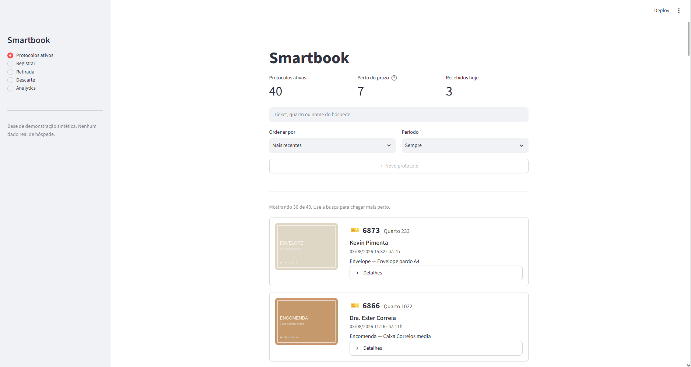

# Smartbook

Sistema de controle de protocolo de itens recebidos na portaria de hotel.
Substitui o caderno físico usado hoje para registrar encomendas, sacolas e
envelopes deixados para hóspedes.

> **Todos os dados desta demonstração são sintéticos.** Nenhum dado real de
> hóspede em nenhum ponto do sistema. Ver [Privacidade](#privacidade).



---

## O problema não é o registro. É a fricção.

O caderno físico funciona. O que ele não faz é ser fácil de usar.

Na operação real, a recepção deixa de retirar itens do armário porque abrir o
caderno, achar a linha certa e escrever custa tempo com o hóspede esperando.
O resultado não é registro errado: é **item que fica no armário porque ninguém
quis mexer no caderno**.

Isso tem consequência mensurável. Item parado é o que enche a prateleira, é o
que vence a política de descarte de 6 meses, e é a única condição sob a qual o
identificador físico do sistema pode se repetir (ver
[O ciclo do rolo](#o-ciclo-do-rolo-de-tickets)).

**Reduzir toques não é conforto. É o mecanismo que resolve o problema
operacional.** Esse é o critério de projeto: toda tela e todo campo precisa
justificar o toque que adiciona.

O domínio vem de operação real: um hotel de aeroporto em Guarulhos, ~400
quartos, perfil de estadia curta (muitos hóspedes ficam menos de 24h por causa
da proximidade com o aeroporto) e presença regular de tripulações aéreas.

---

## Perguntas que a base responde

O sistema é um registro operacional, mas foi modelado para que o registro
produza análise. Números abaixo saem da base sintética, calibrada em
observação da operação real.

**Quando chega o volume**

| Turno | Itens | Fatia |
|---|---|---|
| Manhã (07-15) | 313 | 43,5% |
| Tarde (15-23) | 298 | 41,4% |
| Madrugada (23-07) | 109 | 15,1% |

A madrugada parece morta até separar por tipo de público: **85 dos 109 itens da
madrugada são de tripulação**, contra 24 de hóspedes comuns. O turno não é
ocioso, ele atende outro público.

**Quanto tempo o item fica no armário**

| Público | Mediana até a retirada |
|---|---|
| Hóspede | 23,8h |
| Tripulação | 3,7h |

Diferença de 6x. Tripulação retira no mesmo pernoite; hóspede leva cerca de um
dia. Isso dimensiona quanto espaço de armário cada público consome e em qual
turno a demanda de retirada aparece.

**O que as pessoas recebem** (agregado por categoria, sem ligação com
indivíduo)

| Categoria | Fatia |
|---|---|
| Encomenda | 38,9% |
| Sacola | 17,6% |
| Bagagem | 15,1% |
| Envelope | 14,3% |

Esse recorte tem uso comercial direto: categorias que aparecem muito indicam o
que o hóspede está comprando fora porque não encontra dentro do hotel.

**Nota de escopo:** a análise para aqui de propósito. Perfilar *o que cada
hóspede compra* seria usar um dado entregue para guarda como dado de
comportamento, sem consentimento. O agregado por categoria leva à mesma decisão
de negócio sem tocar em quem comprou o quê.

---

## Privacidade

Não é uma seção de conformidade no rodapé. É restrição de design, e aparece
no schema:

- **Base 100% sintética.** Nomes gerados com Faker (`pt_BR`), imagens geradas
  por código. Nenhuma foto baixada, nenhum registro real.
- **Documento nunca armazenado por inteiro.** Só os 3 últimos dígitos, com
  `CHECK (length(...) <= 3)` no banco. Suficiente para conferir contra o
  documento em mãos, inútil para vazamento.
- **Placeholder de documento sem número, nem falso.** As imagens sintéticas de
  RG e autorização não desenham dígito nenhum. A regra do schema vale até o
  pixel.
- **Nomes de companhia aérea são públicos; o padrão de pernoite não é.** As
  companhias aparecem como rótulo, mas a distribuição de horário de chegada de
  tripulação foi inventada, não observada. Rotina de pernoite de tripulação num
  hotel identificável é informação sobre pessoas identificáveis.
- **Minimização por padrão.** Cada campo opcional precisa de uso definido para
  existir.

---

## Decisões de modelagem

**O ticket não é chave primária.**
O item é identificado por um ticket físico de duas vias: uma fica no item, a
outra no registro. O rolo tem 4 dígitos (às vezes 5), é compartilhado com
bagagem, e reinicia. O mesmo número volta a circular.

A tentação é declarar `UNIQUE`. Seria errado: constraint não negocia, e um
`INSERT` recusado trava o colaborador no balcão com o hóspede esperando. O
sistema precisa refletir a realidade, e a realidade permite colisão.

A solução é chave substituta: o banco tem `id` próprio, exibido como código
legível (`SB-2026-0417`), que nunca repete. O ticket vira campo de busca
indexado, sem `UNIQUE`, e a colisão entre protocolos **ativos** é detectada e
avisada pela view `vw_ticket_colidido`, nunca bloqueada.

**Ticket é TEXT, não INTEGER.**
`0042` armazenado como número vira `42`, e a busca por `0042` não acha nada. Uma
coluna gerada (`ticket_num`, virtual e indexada) permite achar `0042` digitando
`42`, sem perder o zero à esquerda no armazenamento.

**Status e turno são derivados, nunca armazenados.**
`entregue_em IS NULL` define ativo. Coluna de status redundante é fonte clássica
de inconsistência (status "ativo" com data de entrega preenchida), e os `CHECK`
do schema impedem estado impossível. Turno sai do horário na consulta: mudar a
faixa de um turno reclassifica todo o histórico sem `UPDATE`.

**Quarto é o quarto de entrada, não o quarto atual.**
Hóspedes trocam de quarto e quartos trocam de hóspede no mesmo dia. Gravar o
quarto dentro do protocolo congela o dado no momento do recebimento, que é o
que importa. Por isso o hóspede não é normalizado: o par nome/quarto só é
estável dentro de uma estadia, e modelar estadia é outro projeto.

**Comprovação de retirada, não assinatura digital.**
Assinatura digital com validade jurídica é certificado ICP-Brasil, e é outro
projeto. O que o sistema faz é registrar evidência: quem retirou, tipo e
últimos dígitos do documento, assinatura em canvas, colaborador que entregou e
timestamp. Retirada pelo destinatário exige assinatura; retirada por terceiro
exige também foto do documento e da autorização, espelhando a regra que o hotel
já aplica no papel.

---

## O ciclo do rolo de tickets

O achado que só existe porque o domínio é conhecido de dentro.

A colisão de ticket parece azar. Não é. Tickets saem de um rolo **em ordem**,
então dois itens nunca colidem por coincidência: eles colidem porque o rolo deu
a volta e voltou num número que ainda está pendurado num item no armário.

Isso torna a colisão previsível a partir de dois números:

```
ciclo do rolo = 9999 números ÷ 30 itens por dia = 333 dias
política de descarte                            = 180 dias
```

**Enquanto o descarte acontecer no prazo, colisão é impossível.** Nenhum item
sobrevive 333 dias se sai aos 180. A folga é de 153 dias.

Quem consome essa folga não é a numeração, é a limpeza que não acontece: na
operação real, a última limpeza do armário foi há mais de um ano.

| Limpeza a cada | Colisões esperadas por ciclo |
|---|---|
| 180 dias (a política) | 0 |
| 333 dias | 0 |
| 500 dias | 1,2 |
| 730 dias | 6,8 |

**Conclusão que inverte o desenho do produto:** colisão de ticket não é problema
de numeração, é sintoma de descarte atrasado. A tela de descarte deixa de ser
funcionalidade acessória e passa a ser o controle que previne o único problema
de identificação do sistema.

---

## Dados sintéticos calibrados

O valor de dado sintético não está em ser verdadeiro (é falso por definição),
e sim em o **modelo gerador** ser defensável. Cada parâmetro em `src/seed.py`
está rotulado pela origem:

| Rótulo | Significado | Exemplos |
|---|---|---|
| `[OBSERVADO]` | regra ou fato verificável da operação | política de 180 dias, faixa de quartos, turnos |
| `[ESTIMADO]` | estimativa de quem trabalha na portaria, **sem contagem sistemática** | 3 protocolos/dia, mediana de 24h, razão 1:9 com bagagem |
| `[DERIVADO]` | calculado a partir dos anteriores, com a conta no código | 4,8% de itens encalhados, ciclo de 333 dias |

Os `[DERIVADO]` são expressão em Python, não número fixo. Quem discordar de uma
entrada vê a fórmula e recalcula.

A base usa `random.seed(42)`: o mesmo comando gera a mesma base em qualquer
máquina.

**O que a calibragem produziu:**

| Observado na operação | Gerado pela base |
|---|---|
| ~30 itens no armário | 38 |
| 2 a 3 acima de 6 meses | 2 |
| retirada em ~1 dia | mediana de 23,8h |
| tripulação retira no pernoite | mediana de 3,7h |

---

## Stack

Python · Streamlit · SQLite · Faker · Pillow

Sem framework web tradicional, por decisão de escopo: o foco do projeto é
modelagem e análise de dados, não construção de frontend.

**Separação em camadas:** `src/db.py` não importa `streamlit`, e `app.py` não
contém SQL. As consultas podem ser testadas sem abrir o app
(`python src/db.py`), e trocar a interface não exige reescrever a lógica.

---

## Como rodar

```bash
pip install -r requirements.txt

python src/init_db.py    # cria o banco a partir de sql/schema.sql
python src/seed.py       # gera a base sintética
python src/db.py         # testa as consultas sem abrir o app
streamlit run app.py
```

**Nota de deploy:** o filesystem do Streamlit Community Cloud é efêmero, então
a base sintética e as imagens são versionadas no repositório. Um app que
dependesse de escrita em runtime voltaria vazio depois de reiniciar. O que for
cadastrado durante uma visita à demo dura até o próximo restart.

---

## Estado atual

**Funcionando**
- Schema completo com constraints, índices e views derivadas
- Gerador de base sintética calibrado em observação da operação
- Tela de protocolos ativos: contadores, busca unificada (ticket, quarto ou
  nome), ordenação, filtro de período, alerta de prazo e de colisão

**Em construção**
- Registro de novo protocolo
- Retirada com comprovação (canvas de assinatura)
- Tela de descarte
- Painel de analytics

---

## Arquitetura pronta, não ativada

Implementado até o ponto em que a integração externa começa. Não ativado por
decisão de custo (API paga) e porque não seria testável numa demonstração
sintética.

- **Notificação de chegada** por SMS ou e-mail
- **Aviso de descarte** antes dos 180 dias
- **Código de verificação (OTP)** para retirada, já previsto na tabela
  `verificacao` e no enum de conferência
- **Integração com o PMS** do hotel

A função `notificar(protocolo_id, canal, finalidade)` grava em tabela local.
Trocar o corpo dela por uma chamada de API não exige mudança de schema.
